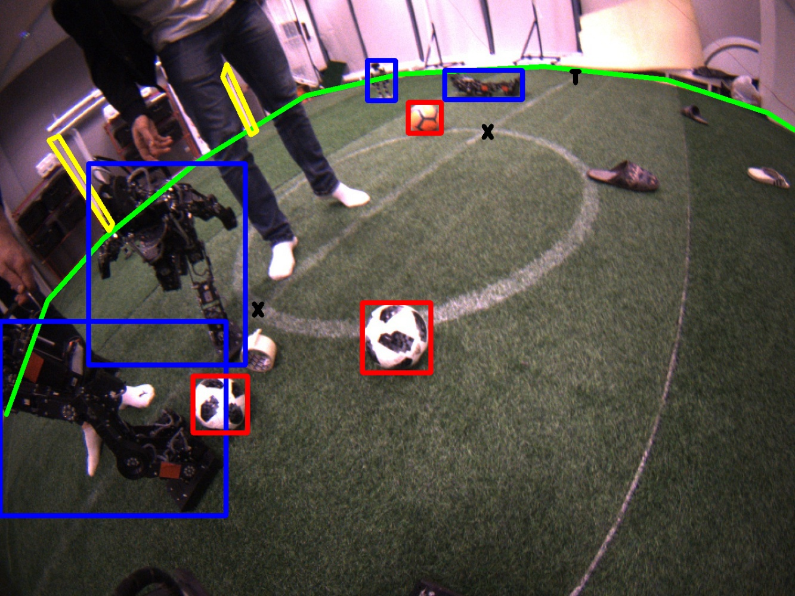

## TORSO-21 Dataset: Typical Objects in RoboCup Soccer 2021

This repository contains the scripts and addtional information for the TORSO-21 Dataset.
This is a dataset for the RoboCup Humanoid Soccer domain consisting of images of the Humanoid League as well as the Standard Platform League. We provide two image collections. The first one consists of images from various real-world locations, recorded by different robots. It includes annotations for the ball, goalposts, robots, lines, field edge, and three types of line intersections. The second collection is generated in the Webots simulator which is used for the official RoboCup Virtual Humanoid Soccer Competition. Additionally to the labels of the first collection, labels for the complete goal, depth images, 6D poses for all labels, as well as the camera location in the field of play, are provided.

### Example images





## Download Dataset and Labels

The images can be downloaded here: https://cloud.crossmodal-learning.org/s/3wt3Sgyxc7pC5QT

Or, an automated script can be used: `./scripts/download_dataset.py --all`

To visualize the annotations, run the following two commands to pickle and show the annotations:

```
./scripts/pickle_annotations.py data/reality/train/annotations.yaml
./scripts/viz_annotations.py data/reality/train/annotations.pkl
```

## Structure

The repository structure is as follows:

```
├── data                          # contains the annotations and images
│   ├── reality                   # the images recorded in reality
│   │   ├── train                 # the training set
│   │   │   ├── annotations.yaml  # the annotations in yaml format
│   │   │   ├── images/           # a folder containing all the images of the training set
│   │   │   └── segmentations/    # a folder containing all the segmentation masks of the training set
│   │   └── test                  # the test set
│   │       └── ...               # it is structured in the same way as the training set 
│   └── simulation                # the images recorded in simulation
│       ├── train                 # the training set
│       │   ├── annotations.yaml  # the annotations in yaml format
│       │   └── depth/            # a folder containing all the depth images of the training set
│       │   ├── images/           # a folder containing all the images of the training set
│       │   └── segmentations/    # a folder containing all the segmentation masks of the training set
│       └── test                  # the test set
│           └── ...               # it is structured in the same way as the training set 
└── scripts                       # some useful scripts, see below for details
    └── ...
```

The annotations are in the following format:

```yaml
images:
  130-16_02_2018__11_16_34_0000_upper.png:
    width: 1920
    height: 1080
    annotations:
      - blurred: true
        concealed: true
        in_image: true
        type: robot
        vector:
        - - 42 # x value
          - 26 # y value
        - - 81
          - 98
        pose: # The pose of the annotated object, only available in simulation
          position:
            x: 0
            y: 0
            z: 0
          orientation:
            x: 0
            y: 0
            z: 0
            w: 0
          motion: standing
      - in_image: false
        type: ball
    metadata: # The keys should be like this but do not need to be present for all images
      fov: 42
      location: "foobay"
      tags: ["natural_light", "telstar18", "do_not_use"]
      imageset_id: 130
      camera_pose: # The pose of the annotated object, only available in simulation
        position:
          x: 0
          y: 0
          z: 0
        orientation:
          x: 0
          y: 0
          z: 0
          w: 0
      Natural light: False
      League: HSL
      ...
```


## Statistics and checks

#### `metadata_statistics.py`

Generates metadata statistics from an annotations file, i.e. how often which metadata type occurs.

#### `annotation_statistics.py`

This script is used to generate statistics about the annotations, i.e. how often each annotation
occurs per image. Its first argument is the annotation file to generate annotations for.

#### `sanity_check.py`

Sanity-checks the annotations, i.e. checks if some labels are marked as in image and not in image
and if the field boundary is contained.


## Documentation of the scripts

### Installation

Follow these instructions to set up the dependencies for the dataset scripts and the autoencoder.

```
# Clone the repository
git clone https://github.com/bit-bots/vision_dataset_2021.git
cd vision_dataset_2021/scripts

# Install poetry
pip3 install poetry --user

# Install dependencies
poetry install
```

### Usage

To run the tools you need to source the poetry environment in your shell.

```
# Source the virtualenv
poetry shell
```

You can also use `poetry run <script>` to run scripts without sourcing.

### Scripts

#### `download_and_merge_data.py`

This script downloads multiple image sets and annotations from the ImageTagger.
The imagesets and the annotation format are defined at the top of the file.
Its output is a folder `data_raw` in the root of this repository that contains all image files.
To avoid conflicting names, every filename is prepended with its dataset id.
Additionally, a file `annotations.yaml` is created that contains a dict mapping set ids to their
metadata and a dict mapping image names to their labels.

#### `download_from_imagetagger.py`

This is just a verbatim copy of the ImageTagger download script. Its API is used by
`download_and_merge_data.py`, it it not necessary to use this script directly.

#### `annotation_filter.py`

This script filters the annotations contained in `data_raw/annotations.yaml` to only include the
images in the `data` folder and creates a `data/annotations.yaml` file.

#### `imagetagger_prepare_script.py`

This script prepares the files in `data` for the ImageTagger, i.e. zips the images and converts the
annotations to the upload format.

#### `line_label_tool.py`

This script can be used to label lines.

#### `convert_pascal_voc.py`

This script converts labels from the Pascal VOC XML format to the `yaml` format as defined above.

#### `add_metadata.py`

Creates the file `data/annotations_with_metadata.yaml` from `data/annotations.yaml` and
`data/metadata.csv`. `annotations.yaml` can be downloaded from the ImageTagger, `metadata.csv` has
to be manually created.

### Variational Autoencoder

The variational autoencoder, we have used, is based on [noctrog's conv-vae](https://github.com/noctrog/conv-vae).

The training code for the autoencoder is located in `scripts/vae/`.

#### `vae/train.py`

This file runs the training of the vae.
More details are avalible by running `vae/train.py -h`.

#### `vae/reconstruct.py`

This script runs the autoencoder on a given input and shows the recnstruction of the image.
More details are avalible by running `vae/reconstruct.py -h`.

#### `vae/embeddings.py`

This script runs the vae recursivly on all image inside a given folder and saves their latent space representation inside a file.
More details are avalible by running `vae/embeddings.py -h`.

#### Architecture

| #  | Layer (type)        | Output Shape   | Param #   |
|----|---------------------|----------------|-----------|
|    | Input               | (3, 128, 112)  | 0         |
| 1  | Conv2d              | (32, 64, 56)   | 896       |
| 2  | BatchNorm2d         | (32, 64, 56)   | 64        |
| 3  | LeakyReLU           | (32, 64, 56)   | 0         |
| 4  | Conv2d              | (64, 32, 28)   | 18,496    |
| 5  | BatchNorm2d         | (64, 32, 28)   | 128       |
| 6  | LeakyReLU           | (64, 32, 28)   | 0         |
| 7  | Conv2d              | (64, 16, 14)   | 36,928    |
| 8  | BatchNorm2d         | (64, 16, 14)   | 128       |
| 9  | LeakyReLU           | (64, 16, 14)   | 0         |
| 10 | Conv2d              | (64, 8, 7)     | 36,928    |
| 11 | BatchNorm2d         | (64, 8, 7)     | 128       |
| 12 | LeakyReLU           | (64, 8, 7)     | 0         |
| 13 | Linear              | (300)          | 1,075,500 |
| 14 | LeakyReLU           | (300)          | 0         |
| 15 | Dropout             | (300)          | 0         |
| 16 | Linear              | (300)          | 1,075,500 |
| 17 | LeakyReLU           | (300)          | 0         |
| 18 | Dropout             | (300)          | 0         |
| 19 | Linear              | (3584)         | 1,078,784 |
| 20 | LeakyReLU           | (3584)         | 0         |
| 21 | Dropout             | (3584)         | 0         |
| 22 | UpsamplingNearest2d | (64, 16, 14)   | 0         |
| 23 | ConvTranspose2d     | (64, 16, 14)   | 36,928    |
| 24 | BatchNorm2d         | (64, 16, 14)   | 128       |
| 25 | LeakyReLU           | (64, 16, 14)   | 0         |
| 26 | psamplingNearest2d  | (64, 32, 28)   | 0         |
| 27 | ConvTranspose2d     | (64, 32, 28)   | 36,928    |
| 28 | BatchNorm2d         | (64, 32, 28)   | 128       |
| 29 | LeakyReLU           | (64, 32, 28)   | 0         |
| 30 | UpsamplingNearest2d | (64, 64, 56)   | 0         |
| 31 | ConvTranspose2d     | (32, 64, 56)   | 18,464    |
| 32 | BatchNorm2d         | (32, 64, 56)   | 64        |
| 33 | LeakyReLU           | (32, 64, 56)   | 0         |
| 34 | UpsamplingNearest2d | (32, 128, 112) | 0         |
| 35 | ConvTranspose2d     | (3, 128, 112)  | 867       |
| 36 | Sigmoid             | (3, 128, 112)  | 0         |

### Generation of Simulation Data

The code for generating the simulation data can be found here https://github.com/bit-bots/wolfgang_robot/blob/feature/recognition/wolfgang_webots_sim/src/wolfgang_webots_sim/webots_camera_controller.py

TODO better documentation
