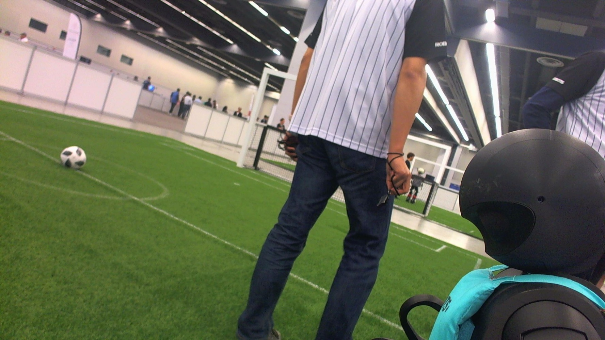
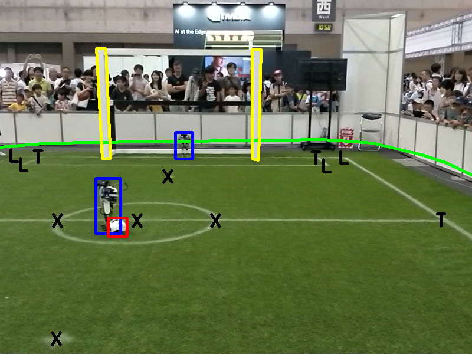
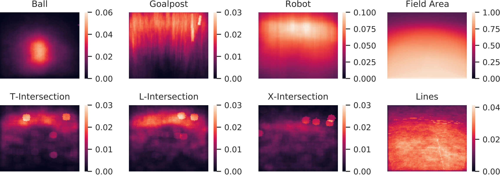

# TORSO-21 Dataset: Typical Objects in RoboCup Soccer 2021

This repository contains the scripts and additional information for the TORSO-21 Dataset.
This is a dataset for the RoboCup Humanoid Soccer domain consisting of images of the Humanoid League as well as the Standard Platform League. We provide two image collections. The first one consists of images from various real-world locations, recorded by different robots. It includes annotations for the ball, goalposts, robots (including team color and player number), lines, field edge, and three types of line intersections. The second collection is generated in the Webots simulator which is used for the official RoboCup Virtual Humanoid Soccer Competition. Additionally to the labels of the first collection, labels for the complete goal, depth images, 6D poses for all labels, as well as the camera location in the field of play, are provided.

## Meta Data
### Real World
| # of Images              | 10464 |
|--------------------------|-------|
| # of Balls               |  6081 |
| # of Robots              |  7641 |
| # of Goalposts           |  7888 |
| # of L-Intersections     | 10375 |
| # of T-Intersection      |  8659 |
| # of X-Intersections     |  7268 |
| # of Field Segmentations | 10464 |
| # of Line Segmentations  | 10464 |

| Robot Team Colors        |       |
|--------------------------|-------|
| # of Blue Robots         |  1277 |
| # of Red Robots          |  1917 |
| # of Unknown Robots      |  4447 |

| Robot Player Numbers     |       |
|--------------------------|-------|
| # of Robots w/out #      |  6526 |
| # of Robots with #1      |   229 |
| # of Robots with #2      |   162 |
| # of Robots with #3      |   276 |
| # of Robots with #4      |   309 |
| # of Robots with #5      |    42 |
| # of Robots with #6      |    97 |

### Simultation
**\# of simulated images: 24.000**

## Example images

### Real-World




With annotations marked



With segmentations of lines and field


### Simulation


With annotations, segmentation mask and depth image


## Download Dataset and Labels

### Manual Download

The images and annotations can be downloaded here: <https://data.bit-bots.de/TORSO-21/>

### Automated Download

The data can also be downloaded with the following script (use `--help` for further options):

```shell
./scripts/download_dataset.py --all
```

### YOLO Label Format

If you want to train a YOLO, you can use the script provided in [this repository](https://github.com/bit-bots/AutoImageLabeler#create-labels-for-training) to generate the labels.

## Structure

The repository structure is as follows:

```raw
├── data                          # contains the annotations and images
│   ├── reality                   # the images recorded in reality
│   │   ├── train                 # the training set
│   │   │   ├── annotations.yaml  # the annotations in yaml format
│   │   │   ├── images/           # a folder containing all the images of the training set
│   │   │   └── segmentations/    # a folder containing all the segmentation masks of the training set
│   │   └── test                  # the test set
│   │       └── ...               # it is structured in the same way as the training set
│   └── simulation                # the images recorded in simulation
│       ├── train                 # the training set
│       │   ├── annotations.yaml  # the annotations in yaml format
│       │   └── depth/            # a folder containing all the depth images of the training set
│       │   ├── images/           # a folder containing all the images of the training set
│       │   └── segmentations/    # a folder containing all the segmentation masks of the training set
│       └── test                  # the test set
│           └── ...               # it is structured in the same way as the training set
└── scripts                       # some useful scripts, see below for details
    └── ...
```

The annotations are in the following format:

```yaml
images:
  130-16_02_2018__11_16_34_0000_upper.png:
    width: 1920
    height: 1080
    annotations:
      - blurred: true
        color: unknown # possible values {blue, red, unknown}
        concealed: false
        in_image: true
        number: null # possible values {null, 1, 2, 3, 4, 5, 6}
        type: robot
        vector:
        - - 42 # x value
          - 26 # y value
        - - 81
          - 98
        pose: # The pose of the annotated object, only available in simulation
          position:
            x: 0
            y: 0
            z: 0
          orientation:
            x: 0
            y: 0
            z: 0
            w: 0
          motion: standing
      - in_image: false
        type: ball
    metadata: # The keys should be like this but do not need to be present for all images
      fov: 42
      location: "foobay"
      tags: ["natural_light", "telstar18", "do_not_use"]
      imageset_id: 130
      camera_pose: # The pose of the annotated object, only available in simulation
        position:
          x: 0
          y: 0
          z: 0
        orientation:
          x: 0
          y: 0
          z: 0
          w: 0
      Natural light: False
      League: HSL
      ...
```

## Scripts

### Set up environment

Follow these instructions to set up the dependencies for the scripts used for visualization and creation of the dataset.

1. Install the package manager Poetry as described [here](https://python-poetry.org/docs/#installation). This prevents dependency conflicts and ensures that the correct versions of the dependencies are installed.

2. Clone the repository:

    ```shell
    git clone https://github.com/bit-bots/TORSO_21_dataset.git
    ```

3. Move into the repository and install the dependencies

    - without optional dependencies (for dataset creation):

        ```shell
        cd TORSO_21_dataset && poetry install --without=dev --no-root
        ```

    - with optional dependencies (for dataset creation):

        ```shell
        cd TORSO_21_dataset && poetry install --no-root
        ```

## Usage

To run the tools you need to enter the poetry environment:

```shell
poetry shell
```

Alternatively, you can use `poetry run ./scripts/<file>` to run the scripts without sourcing.

### Visualize annotations

To visualize the annotations, run the following two commands to pickle and show the annotations in
the poetry environment:

```shell
./scripts/pickle_annotations.py data/reality/train/annotations.yaml
./scripts/viz_annotations.py data/reality/train/annotations.pkl
```

### Statistics and checks

#### `metadata_statistics.py`

Generates metadata statistics from an annotations file, i.e. how often which metadata type occurs.

#### `annotation_statistics.py`

This script is used to generate statistics about the annotations, i.e. how often each annotation
occurs per image. Its first argument is the annotation file to generate annotations for.

#### `sanity_check.py`

Sanity-checks the annotations, i.e. checks if some labels are marked as in image and not in image
and if the field boundary is contained.

### YOLO Evaluation

Simple script that runs a YOLO model against the test dataset and calculates the IOU metrics.

`./scripts/yolo_eval.py --yolo-path /path/to/yolo_folder --collection data/reality/test`

### Further scripts

To use these scripts, make sure to install all dependencies with `poetry install` (see [Set up environment](#set-up-environment)).

#### `download_and_merge_data.py`

This script downloads multiple image sets and annotations from the ImageTagger.
The imagesets and the annotation format are defined at the top of the file.
Its output is a folder `data_raw` in the root of this repository that contains all image files.
To avoid conflicting names, every filename is prepended with its dataset id.
Additionally, a file `annotations.yaml` is created that contains a dict mapping set ids to their
metadata and a dict mapping image names to their labels.

#### `download_from_imagetagger.py`

This is just a verbatim copy of the ImageTagger download script. Its API is used by
`download_and_merge_data.py`, it it not necessary to use this script directly.

#### `annotation_filter.py`

This script filters the annotations contained in `data_raw/annotations.yaml` to only include the
images in the `data` folder and creates a `data/annotations.yaml` file.

#### `imagetagger_prepare_script.py`

This script prepares the files in `data` for the ImageTagger, i.e. zips the images and converts the
annotations to the upload format.

#### `line_label_tool.py`

This script can be used to label lines.

#### `convert_pascal_voc.py`

This script converts labels from the Pascal VOC XML format to the `yaml` format as defined above.

#### `add_metadata.py`

Creates the file `data/annotations_with_metadata.yaml` from `data/annotations.yaml` and
`data/metadata.csv`. `annotations.yaml` can be downloaded from the ImageTagger, `metadata.csv` has
to be manually created.

#### `fix_segmentations.py`

This script was used to resolve an issue regarding the segmentation images of the reality collection.
This fixes the issue of incorrect color values of the class `field` caused by anti-aliasing and a old bug in the `line_label_tool`.

### Variational Autoencoder

The variational autoencoder, we have used, is based on [noctrog's conv-vae](https://github.com/noctrog/conv-vae).

The training code for the autoencoder is located in `scripts/vae/`.

#### `vae/train.py`

This file runs the training of the vae.
More details are avalible by running `vae/train.py -h`.

#### `vae/reconstruct.py`

This script runs the autoencoder on a given input and shows the reconstruction of the image.
More details are available by running `vae/reconstruct.py -h`.

#### `vae/embeddings.py`

This script runs the vae recursively on all image inside a given folder and saves their latent space representation und reconstruction errors inside a file.
More details are available by running `vae/embeddings.py -h`.

#### `vae/distances.py`

Plots n'th neighbors in the latent space of a given image.
More details are available by running `vae/distances.py -h`.

#### `vae/duplicates.py`

Creates a yaml file containing three lists containing:

* The images that survived the pruning
* The images that got selected due to the high reconstruction error
* The images that will be removed from the dataset

More details are available by running `vae/duplicates.py -h`.

#### `vae/plot_error.py`

Loads an embeddings file and plots the reconstruction errors.

#### `vae/model.py`

The PyTorch model definition.

#### `vae/dataset.py`

The PyTorch dataset definition.

#### Architecture

| #  | Layer (type)        | Output Shape   | Param #   |
|----|---------------------|----------------|-----------|
|    | Input               | (3, 128, 112)  | 0         |
| 1  | Conv2d              | (32, 64, 56)   | 896       |
| 2  | BatchNorm2d         | (32, 64, 56)   | 64        |
| 3  | LeakyReLU           | (32, 64, 56)   | 0         |
| 4  | Conv2d              | (64, 32, 28)   | 18,496    |
| 5  | BatchNorm2d         | (64, 32, 28)   | 128       |
| 6  | LeakyReLU           | (64, 32, 28)   | 0         |
| 7  | Conv2d              | (64, 16, 14)   | 36,928    |
| 8  | BatchNorm2d         | (64, 16, 14)   | 128       |
| 9  | LeakyReLU           | (64, 16, 14)   | 0         |
| 10 | Conv2d              | (64, 8, 7)     | 36,928    |
| 11 | BatchNorm2d         | (64, 8, 7)     | 128       |
| 12 | LeakyReLU           | (64, 8, 7)     | 0         |
| 13 | Linear              | (300)          | 1,075,500 |
| 14 | LeakyReLU           | (300)          | 0         |
| 15 | Dropout             | (300)          | 0         |
| 16 | Linear              | (300)          | 1,075,500 |
| 17 | LeakyReLU           | (300)          | 0         |
| 18 | Dropout             | (300)          | 0         |
| 19 | Linear              | (3584)         | 1,078,784 |
| 20 | LeakyReLU           | (3584)         | 0         |
| 21 | Dropout             | (3584)         | 0         |
| 22 | UpsamplingNearest2d | (64, 16, 14)   | 0         |
| 23 | ConvTranspose2d     | (64, 16, 14)   | 36,928    |
| 24 | BatchNorm2d         | (64, 16, 14)   | 128       |
| 25 | LeakyReLU           | (64, 16, 14)   | 0         |
| 26 | psamplingNearest2d  | (64, 32, 28)   | 0         |
| 27 | ConvTranspose2d     | (64, 32, 28)   | 36,928    |
| 28 | BatchNorm2d         | (64, 32, 28)   | 128       |
| 29 | LeakyReLU           | (64, 32, 28)   | 0         |
| 30 | UpsamplingNearest2d | (64, 64, 56)   | 0         |
| 31 | ConvTranspose2d     | (32, 64, 56)   | 18,464    |
| 32 | BatchNorm2d         | (32, 64, 56)   | 64        |
| 33 | LeakyReLU           | (32, 64, 56)   | 0         |
| 34 | UpsamplingNearest2d | (32, 128, 112) | 0         |
| 35 | ConvTranspose2d     | (3, 128, 112)  | 867       |
| 36 | Sigmoid             | (3, 128, 112)  | 0         |

### Generation of Simulation Data

The code for generating the simulation data can be found here <https://github.com/bit-bots/wolfgang_robot/blob/feature/recognition/wolfgang_webots_sim/src/wolfgang_webots_sim/webots_camera_controller.py>

## Evaluation

Visualization of the position density of the respective annotations in the image space over all images of the real-world collection:



## Publication

_When you use our dataset or related software, please cite it as follows:_

### TORSO-21 Dataset: Typical Objects in RoboCup Soccer 2021

**Abstract**<br>
We present a dataset specifically designed to be used as a benchmark to compare vision systems in the RoboCup Humanoid Soccer domain.
The dataset is composed of a collection of images taken in various real-world locations as well as a collection of simulated images.
It enables comparing vision approaches with a meaningful and expressive metric.
The contributions of this paper consist of providing a comprehensive and annotated dataset, an overview of the recent approaches to vision in RoboCup, methods to generate vision training data in a simulated environment, and an approach to increase the variety of a dataset by automatically selecting a diverse set of images from a larger pool.
Additionally , we provide a baseline of YOLOv4 and YOLOv4-tiny on this dataset.

[[ResearchGate]](https://www.researchgate.net/publication/352384714_TORSO-21_Dataset_Typical_Objects_in_RoboCup_Soccer_2021)
[[Download]](https://www.researchgate.net/profile/Niklas-Fiedler/publication/352384714_TORSO-21_Dataset_Typical_Objects_in_RoboCup_Soccer_2021/links/60c7cd23299bf108abd953d5/TORSO-21-Dataset-Typical-Objects-in-RoboCup-Soccer-2021.pdf)

```bib
@inproceedings{TORSO2021,
author = {Bestmann, Marc and Engelke, Timon and Fiedler, Niklas and Güldenstein, Jasper and Gutsche, Jan and Hagge, Jonas and Vahl, Florian},
year = {2021},
title = {{TORSO-21 Dataset: Typical Objects in RoboCup Soccer 2021}},
booktitle={RoboCup 2021: Robot World Cup XXIV}
}
```

_NOTE: You can get various citation types in the right sidebar on GitHub "Cite this repository"..._

## Changelog

### July 12, 2021

- Replacement of the segmentations in the reality collection (using the `fix_segmentations.py`). The update towards the publication introduced incorrect color values of the field class in the segmentation images.

### June 27, 2021

- Publication

### November 2023

- Addition of robot team color and player number annotations in the reality collection.
